# 设计模式

## 创建型模式

### 1.简单工厂模式
简单工厂模式(Simple Factory Pattern)：又称为静态工厂方法(Static Factory Method)模式，它属于类创建型模式。在简单工厂模式中，可以根据参数的不同返回不同类的实例。简单工厂模式专门定义一个类来负责创建其他类的实例，被创建的实例通常都具有共同的父类。

简单工厂模式包含如下角色:
Factory 工厂
Product 抽象产品
ConcreteProduct 具体产品
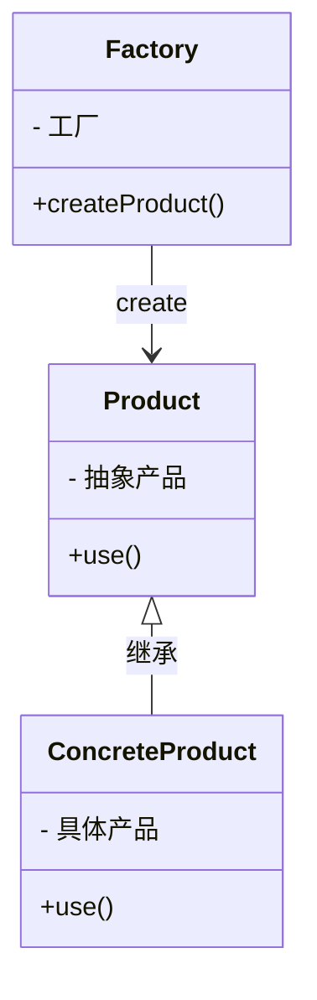

### 2.工厂方法模式
工厂方法模式(Factory Method Pattern)：又称为多态工厂(Polymorphic Factory)模式或虚拟构造器(Virtual Constructor)模式，它属于对象创建型模式。工厂方法模式定义一个用于创建对象的接口，让子类决定将哪一个类实例化。工厂方法模式让一个类的实例化延迟到其子类。

工厂方法模式包含如下角色:
Factory 抽象工厂
ConcreteFactory 具体工厂
Product 抽象产品
ConcreteProduct 具体产品
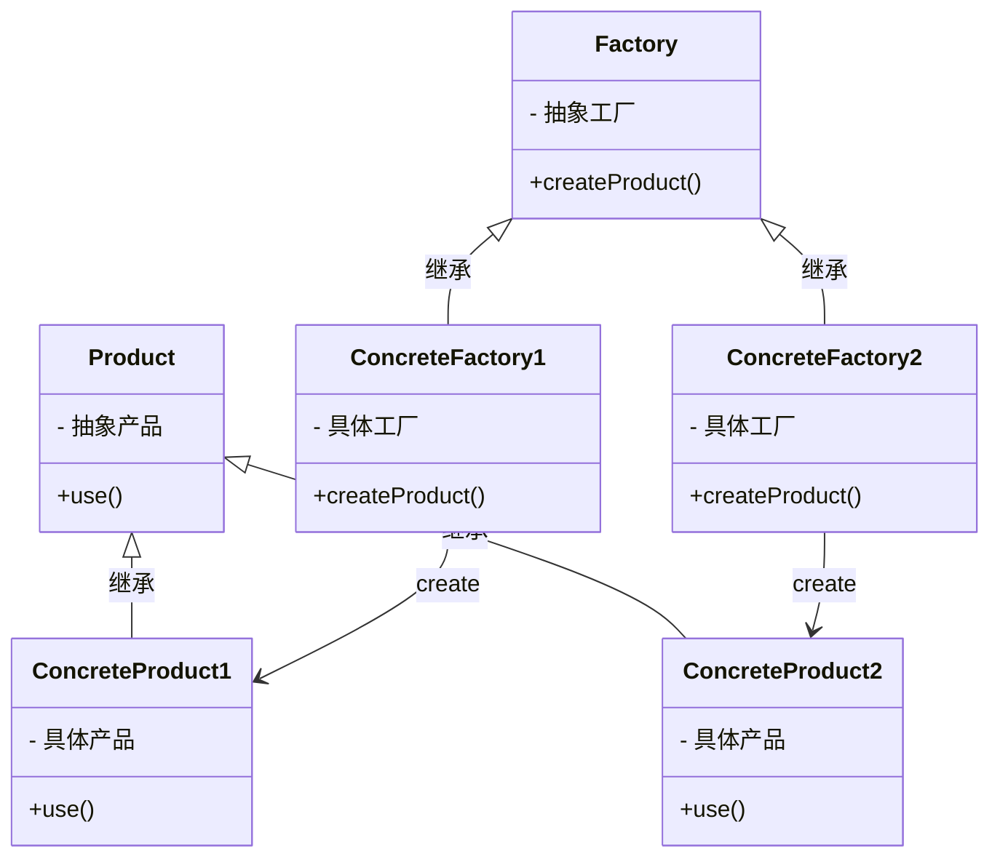

### 3.抽象工厂模式
抽象工厂模式(Abstract Factory Pattern)：提供一个创建一系列相关或相互依赖对象的接口，而无须指定它们具体的类。抽象工厂模式又称为Kit模式，它是一种对象创建型模式。由于很多软件系统都是用分层结构，在业务逻辑层和数据访问层之间引入抽象工厂模式可以隔离变化，使得高层模块不直接依赖于低层模块的具体实现。

抽象工厂模式包含如下角色:
AbstractFactory 抽象工厂
ConcreteFactory 具体工厂
AbstractProduct 抽象产品
ConcreteProduct 具体产品
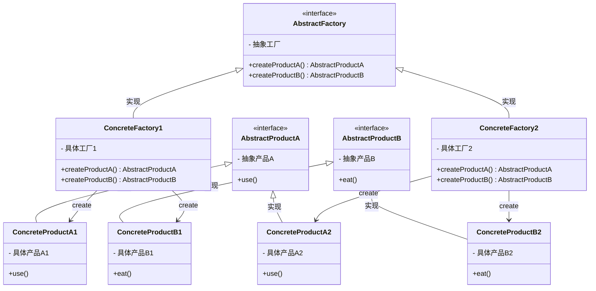

### 4.建造者模式

### 5.单例模式
单例模式(Singleton Pattern)：单例模式确保某一个类只有一个实例，而且自行实例化并向整个系统提供这个实例，这个类称为单例类，它提供全局访问的方法。

单例模式包含如下角色:
Singleton 单例类
SingletonHolder 静态内部类

饿汉式创建单例类
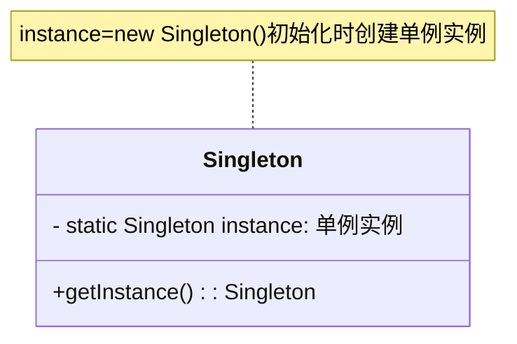
懒汉式创建单例类
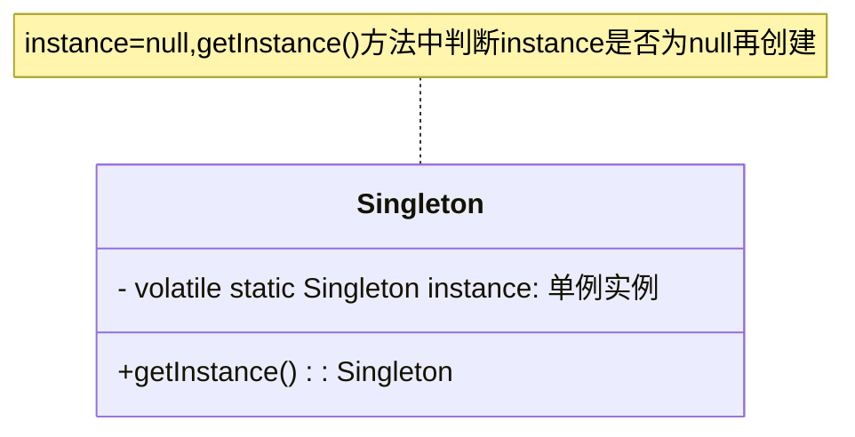
静态内部类创建单例类
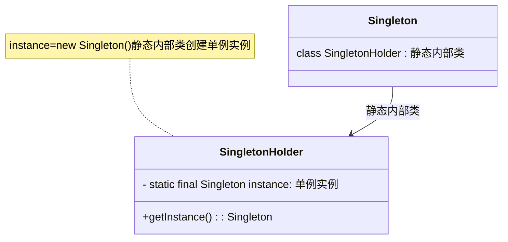
枚举创建单例类
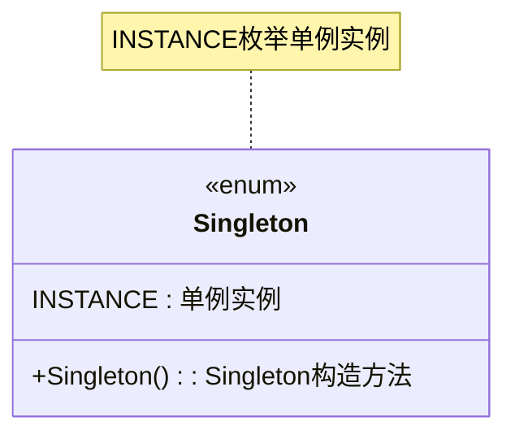
## 结构型模式

### 1.适配器模式
适配器模式(Adapter Pattern) ：将一个接口转换成客户希望的另一个接口，适配器模式使接口不兼容的那些类可以一起工作，其别名为包装器(Wrapper)。适配器模式既可以作为类结构型模式，也可以作为对象结构型模式

适配器模式包含如下角色：

Target：目标抽象类
Adapter：适配器类
Adaptee：适配者类
Client：客户类

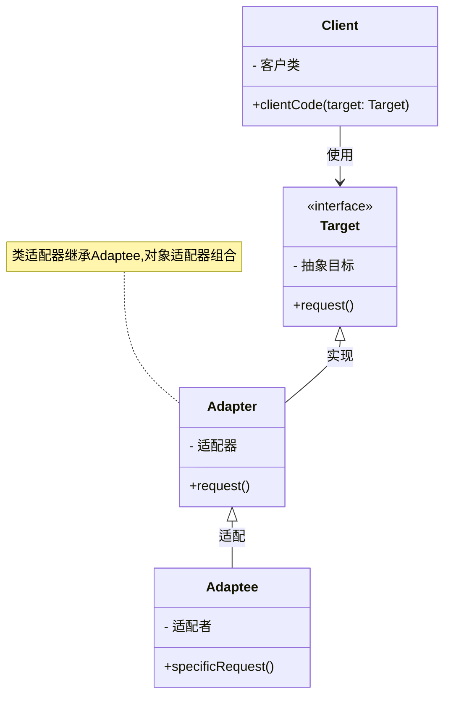

### 2.桥接模式

### 3.装饰模式
装饰模式(Decorator Pattern) ：动态地给一个对象增加一些额外的职责(Responsibility)，就增加对象功能来说，装饰模式比生成子类实现更为灵活。其别名也可以称为包装器(Wrapper)，与适配器模式的别名相同，但它们适用于不同的场合。根据翻译的不同，装饰模式也有人称之为“油漆工模式”，它是一种对象结构型模式。

装饰模式包含如下角色:
Component 抽象构件
ConcreteComponent 具体构件
Decorator 抽象装饰类
ConcreteDecorator 具体装饰类

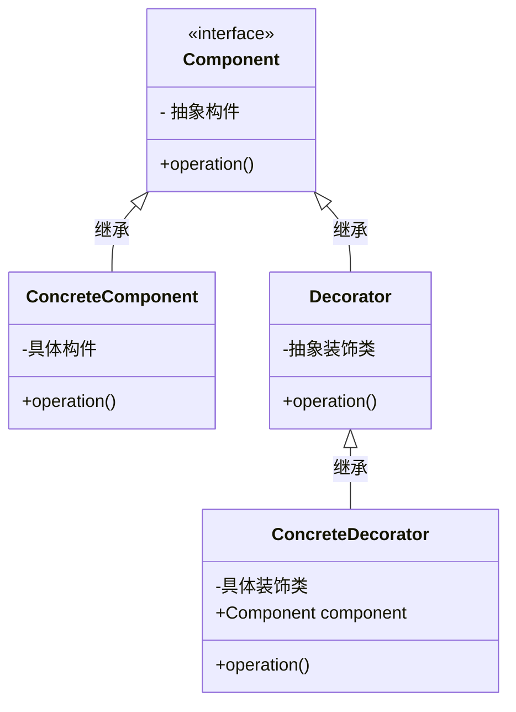

### 4.外观模式
外观模式(Facade Pattern)：外部与一个子系统的通信必须通过一个统一的外观对象进行，为子系统中的一组接口提供一个一致的界面，外观模式定义了一个高层接口，这个接口使得这一子系统更加容易使用。外观模式又称为门面模式，它是一种对象结构型模式。

外观模式包含如下角色:
Facade: 外观角色
SubSystem:子系统角色
Client:客户类
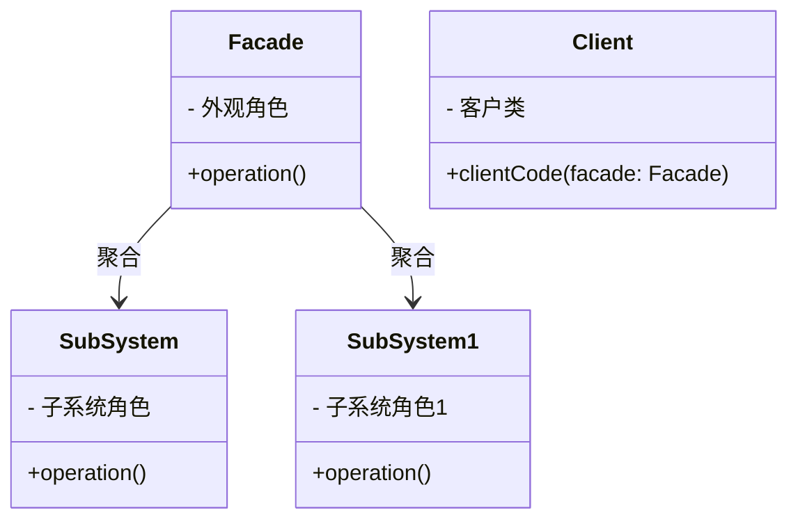

### 5.享元模式

### 6.代理模式

## 行为型模式

### 1.命令模式
命令模式(Command Pattern)：将一个请求封装为一个对象，从而使我们可用不同的请求对客户进行参数化；对请求排队或者记录请求日志，以及支持可撤销的操作。命令模式是一种对象行为型模式，其别名为动作(Action)模式或事务(Transaction)模式。

命令模式包含如下角色：

Command: 抽象命令类
ConcreteCommand: 具体命令类
Invoker: 调用者
Receiver: 接收者
Client:客户类

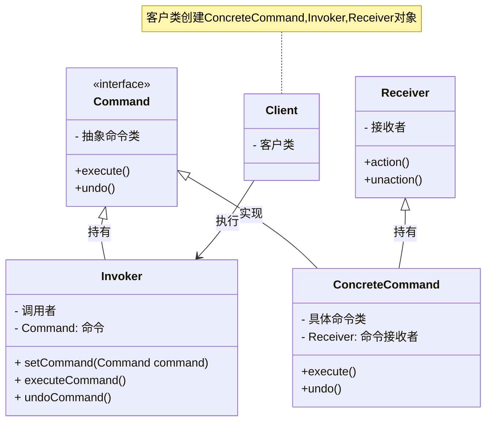

### 2.中介者模式

### 3.观察者模式
观察者模式(Observer Pattern)：定义对象间的一种一对多依赖关系，使得每当一个对象状态发生改变时，其相关依赖对象皆得到通知并被自动更新。观察者模式又叫做发布-订阅（Publish/Subscribe）模式、模型-视图（Model/View）模式、源-监听器（Source/Listener）模式或从属者（Dependents）模式。

观察者模式包含如下角色：

Subject: 目标
ConcreteSubject: 具体目标
Observer: 观察者
ConcreteObserver: 具体观察者

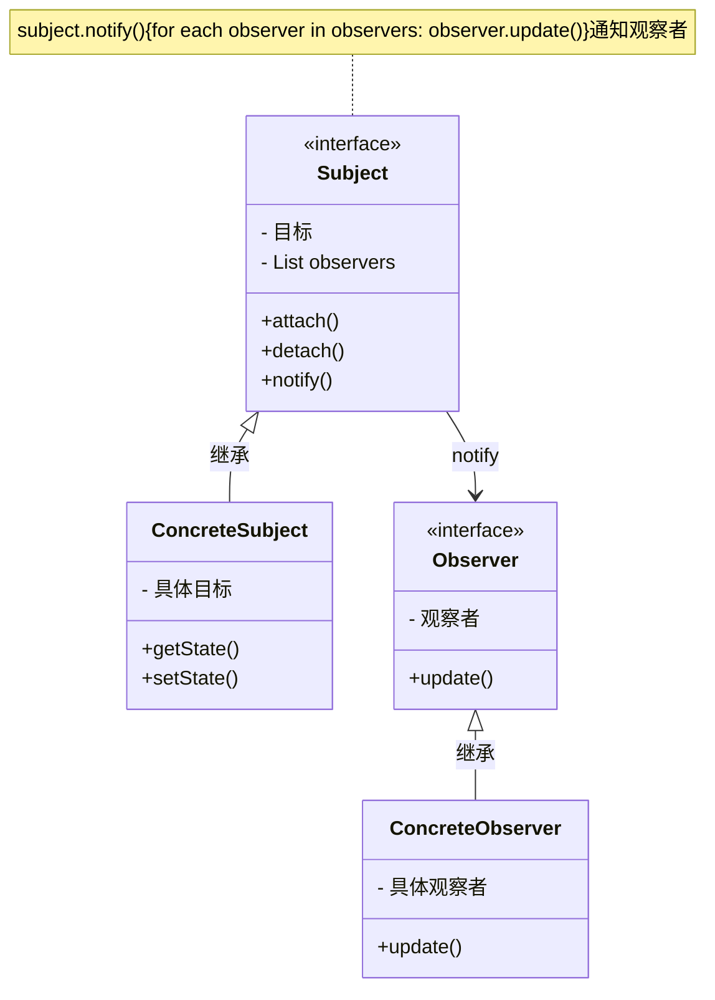

### 4.状态模式

### 5.策略模式
策略模式(Strategy Pattern)：定义一系列算法，将每一个算法封装起来，并让它们可以相互替换。策略模式让算法独立于使用它的客户而变化，也称为政策模式(Policy)。

策略模式包含如下角色:
Context 上下文类
Strategy 抽象策略类
ConcreteStrategy 具体策略类
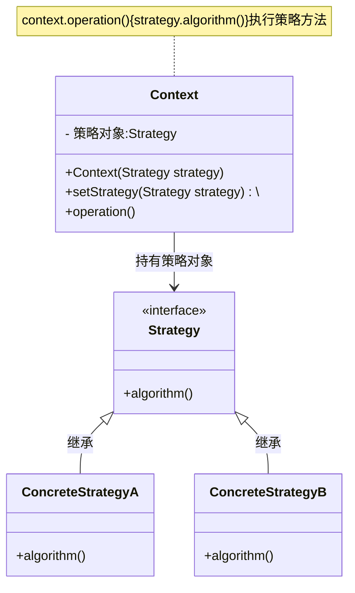

### 6.模板方法模式
模板方法模式(Template Method Pattern)：定义一个操作中的算法的骨架，而将一些步骤延迟到子类中，使得子类可以不改变算法的结构即可重定义该算法的某些特定步骤。
模板方法模式包含如下角色:
    AbstractClass 抽象类
    ConcreteClass 具体类
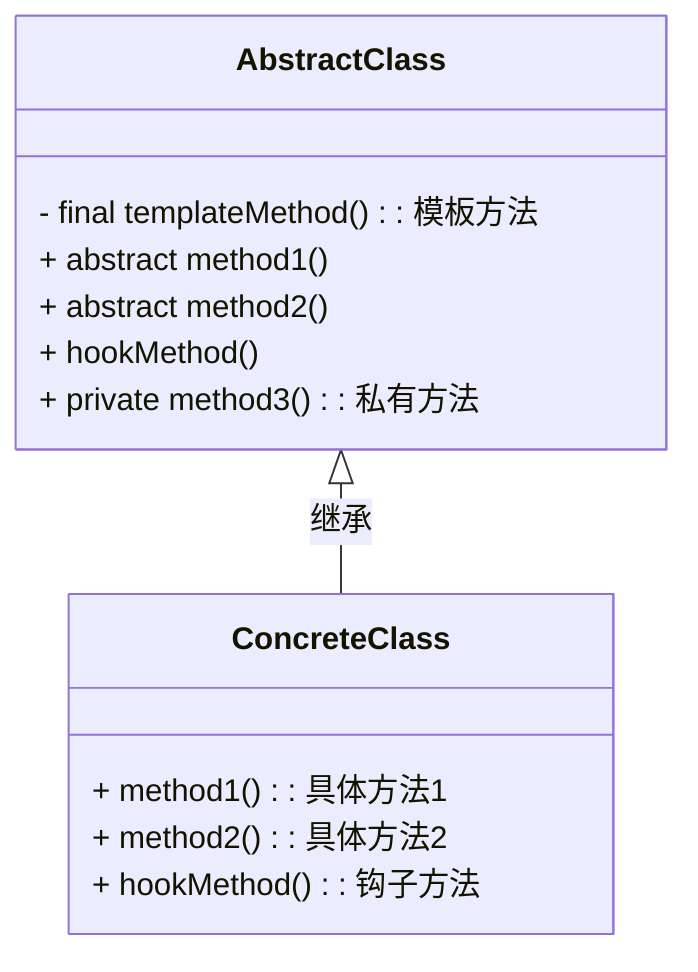